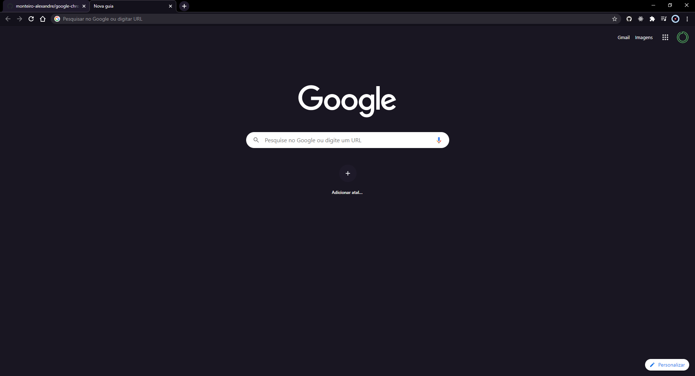

<h1 align="center">
     
    Omni theme for Google Chrome
</h1>

    Dark theme for Google Chrome    

This is not the official Omni theme repository for Google Chrome. See the official [`Repository`](https://github.com/getomni/google-chrome).

    

## Install

Install the official theme through the [Google Chrome Store](https://chrome.google.com/webstore/detail/omni-dark-theme-for-chrom/loclkialbcifjohhglkomgamgpolpcoh).
 

### Or you can install the theme for using this repository

follow the instructions below:

    git clone https://github.com/monteiro-alexandre/google-chrome-omni.git

After cloning the project, go to chrome extensions, and enable the developer mode.

    chrome://extensions

Press the Load without compression, and select the repository folder.

## License

[MIT License](./LICENSE)
